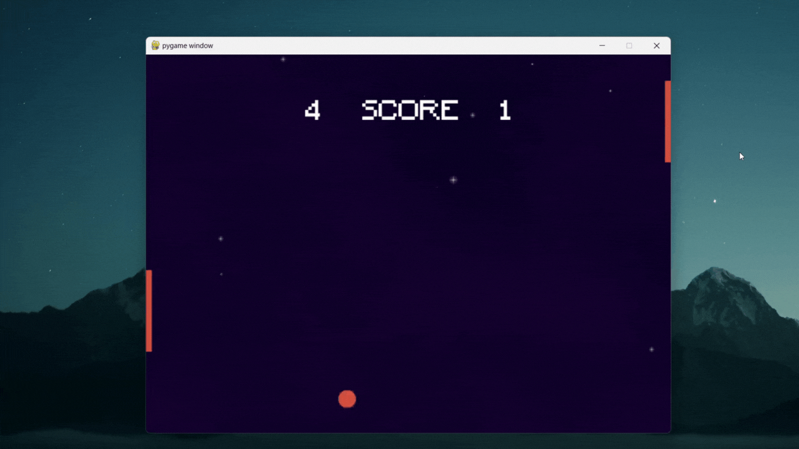

## Description

I was trying to get back into Python, and I thought it would be fun if I try my hands out on a new library along the way. Hence I tried making a simple Pong game with local multiplayer capability.

## Control

Player 1 controls the left paddle with <kbd>W</kbd> and <kbd>S</kbd> key.

Player 2 controls the right paddle with <kbd>&uarr;</kbd> and <kbd>&darr;</kbd> key.

## Preview



## Installation

Make sure Python is installed on your local machine beforehand.

```
pip install pygame
```

## Running the Application

Clone this repository onto your local machine.

```
git clone https://github.com/schoibs/pong-clone.git
```

Navigate into the cloned directory, then run the main Python script (.py) file.

```
python main.py
```
